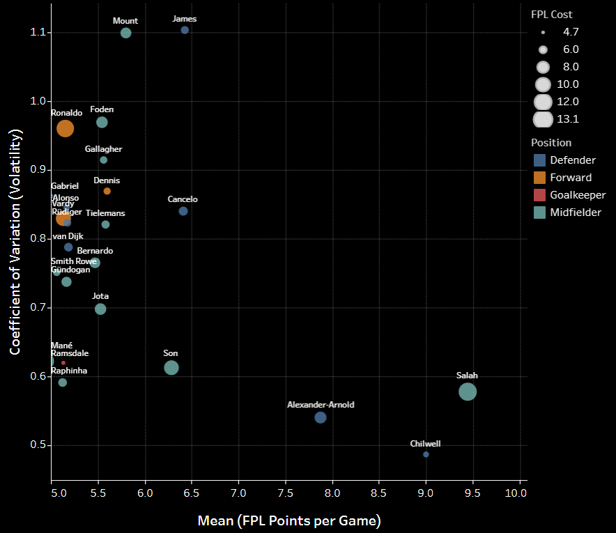

# Fantasy Premier League Insights

Insights to help FPL managers make transfer decisions using the FPL API and xG data from understat. 
## Tableau Public 

[Link to tableau story](https://public.tableau.com/app/profile/sitwala.mundia/viz/FPLInsightGW1-GW1920212022Season/Story1)

 
 
 ## Notebooks
 
 [EDA Notebook](https://github.com/SitwalaM/fpl/blob/main/notebooks/fpl_eda.ipynb)
 
 ### Total Points Distribution
 
This can help with choosing a formation. Here we can clearly see that forwards are not performing as well this season.


### Player Form

We can also look at the top in form players.


## Dimensionality Reduction Using Kernel PCA

A struggle managers often face is trying to factor in several metrics to rate a player. Here, we attempt to use dimensionality reduction on four features from the player data: form, value, total_points and ict_index. [ict_index](https://www.premierleague.com/news/65567) (influence,creativity and threat) is used to assess players who have potential to score points in FPL. Kernel PCA was used with 4 components and polynomial kernel for the fit.


## Deployment

To use this project.
* Clone repo
* Python scripts are in the [scripts folder](https://github.com/SitwalaM/fpl/tree/main/scripts)
* Install environment dependencies in the folder  using

```bash
  pip install -r requirements.txt 
```

To get the latest FPL data, run main.py file using your IDE or
```bash
  python3 main.py
```
The csv files used for the insights will be in the [data folder](https://github.com/SitwalaM/fpl/tree/main/data). Note that you have certain variables available to you in the module for fixture difficulty rating and the xG data.

## License

[](https://github.com/tterb/atomic-design-ui/blob/master/LICENSEs)

## Authors

- [@SitwalaM](https://github.com/SitwalaM)
  
## Acknowledgements/ References

 - [Detailed guide to FPL endpoints](https://medium.com/@frenzelts/fantasy-premier-league-api-endpoints-a-detailed-guide-acbd5598eb19)
 - [Code examples for python FPL data](https://towardsdatascience.com/fantasy-premier-league-value-analysis-python-tutorial-using-the-fpl-api-8031edfe9910)
 - [Understat to FPL ID MAP](https://github.com/ChrisMusson/Football-Datasets)
 - [FPL Dev Discord](https://discord.gg/rEuX54nz)
 

    
